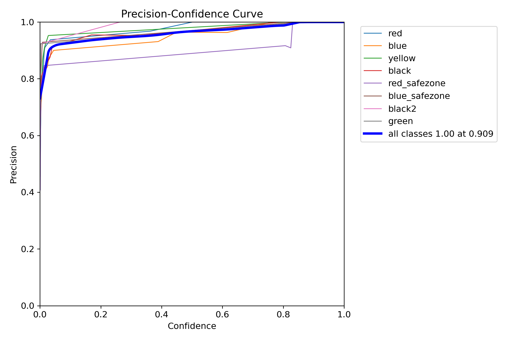
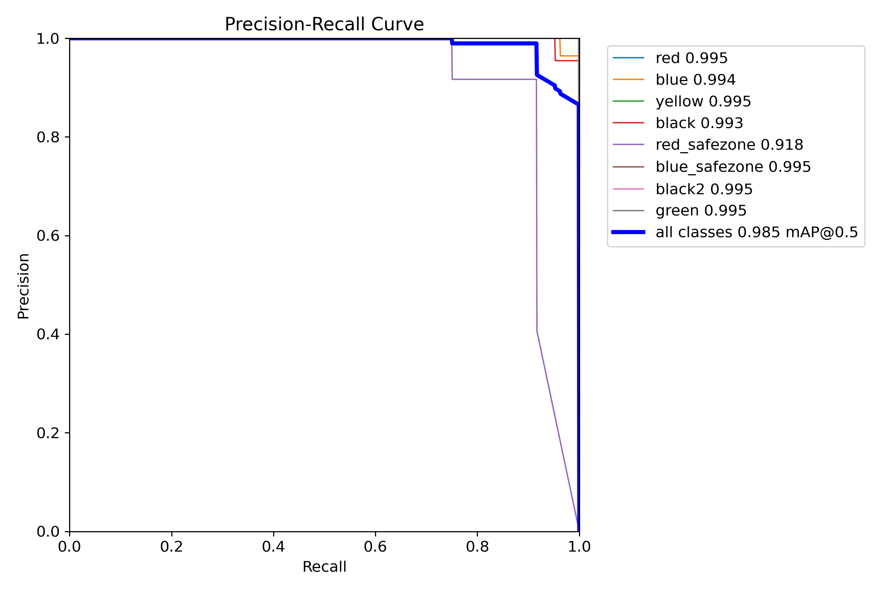
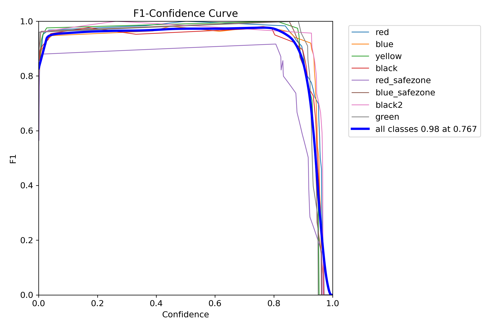
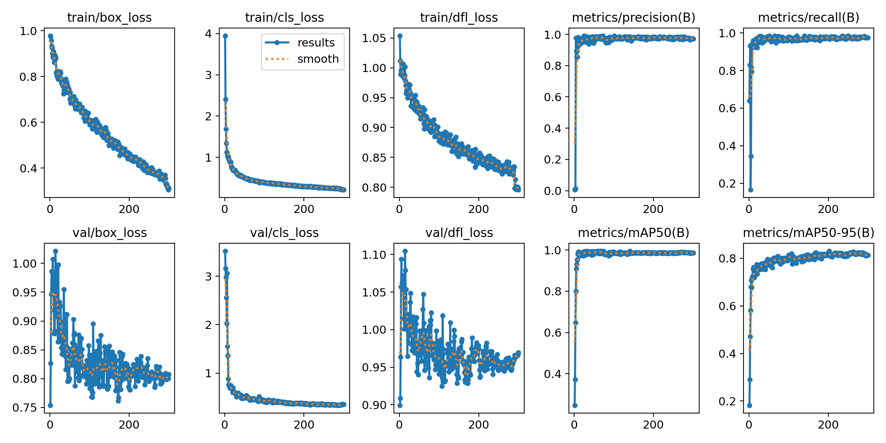

*From the state of art to deploy your models in reality*

[简体中文](README_zh.md)
# Learn machine learning basics
Download and setup conda on [conda](https://anaconda.org/anaconda/conda) or [TsinghuaTuna](https://mirrors.tuna.tsinghua.edu.cn/anaconda/archive/?C=M&O=D)
```shell
$conda
(base)conda create -n pytorch_cpu python=3.9
```
Use [pytorch](https://pytorch.org/) python API to build a MNIST-recognize CNN. Pytorch can run on a local machine using CPU, so don't worry about the NVIDIA GPU requirement.

```shell
$conda
(base)conda activate pytorch_cpu
(pytorch_cpu)pip3 install torch torchvision torchaudio
```
If you have some trouble in setting up environment, you can use [google colab](https://colab.research.google.com/github/pytorch/tutorials/blob/gh-pages/_downloads/0e6615c5a7bc71e01ff3c51217ea00da/tensorqs_tutorial.ipynb#scrollTo=Pzb1CuJSbIVT)
## Basic ideas
Lets begin by introducing some basic ideas in CNN and perform them in pytorch.
### Tensor
Tensor is the very basic data structure in machine learning. From a developer's prespective, tensor is the nickname of high-dimension array in machine learning. For example, we declare a 2D-array in C:
```C
int arr[m][n];
```
This is a tensor in 2 dimensions.In CNN,it can present a 2D black-white image or a channel of an RGB picture.

Also we can declare a 1D-array aka *vector* in C:
```C
int arr[m];
```

In pytorch,we can declare a tensor using:(*see tensor.py*)
```python
shape = (2,3)
tensor=torch.rand(shape)
``` 
And check its attributes using:
```python
tensor.shape
tensor.dtype
tensor.device
```
And manipulate it using:
```python
tensor.add_(1)
#more linear algebra methods will be introduced in the following section
```
methods with "_" indicate that they store the result in their **original** memory,which is sometimes dangerous.
### Linear Algebra Basics 
#### matrix mutiply
*from https://khalidsaifullaah.github.io/neural-networks-from-linear-algebraic-perspective*
```python
torch.matmul(tensor_a,tensor_b)
```
#### transpose
```python
tensor_a.T
```

## Neutral Network
### Neuron model

*from https://www.geeksforgeeks.org/neural-networks-a-beginners-guide/*

The basic units that receive inputs, each neuron is governed by a threshold and an **activation function**.
### Activation Function
An ideal activation function is a step function. But it is never used in practice because it is unsmooth and discontinuous. Sigmoid and ReLU(Rectified linear unit) are more common.


*from https://en.wikipedia.org/wiki/Activation_function*

The activation function introduce no-linearity to neural network, which really matters. Try to think why. 

Hint! Reflect on matmal.
### Layers in multi-layer feedforward neural network


### Loss Function

### Back propagation and Optimizer

## CNN
Convolutional Neural Network (CNN) is an advanced version of artificial neural networks,primarily designed to extract features from grid-like matrix datasets. This is particularly useful for visual datasets such as images or videos, where data patterns play a crucial role.
### CNN structure

*from https://www.geeksforgeeks.org/apply-a-2d-max-pooling-in-pytorch/*

[Yolov8 structure](https://github.com/ultralytics/ultralytics/blob/main/ultralytics/cfg/models/v8/yoloe-v8.yaml)

### convolution

*from https://www.geeksforgeeks.org/apply-a-2d-max-pooling-in-pytorch/*

Convolution operations extract localized features (like edges, textures).
Also see `convolution.py` `convolution_maodie.py`
### pooling

*from https://www.geeksforgeeks.org/apply-a-2d-max-pooling-in-pytorch/*

Pooling (downsampling) reduces spatial dimensions to compress features and control overfitting.
Also see `maxpooling.py`

# Build a CNN for MNIST
## Prepare a dataset
## Define a CNN
## Choose a loss func and optimizer
## train
## test
# Learn how to evaluation a model
## attributes

*from https://docs.ultralytics.com*
### FLOPs/MACs
FLOPs (Floating Point Operations) and MACs (Multiply-Accumulate Operations) are metrics that are commonly used to calculate the computational complexity of deep learning models.Generally,the bigger the number is ,the higher computing ability the model requires.

### params
Parameters in CNNs are primarily the weights and biases learned during training.Generally,the bigger the number is ,the more VRAM the model requires.
## performance metrics
More explanation and real cases in [yolo-performance-metrics](https://docs.ultralytics.com/guides/yolo-performance-metrics/)


### confusion matrix

The confusion matrix provides a detailed view of the outcomes, showcasing the counts of true positives, true negatives, false positives, and false negatives for each class.
### precision/recall
* `Precision` 
quantifies the proportion of true positives among all positive predictions, assessing the model's capability to avoid false positives. 
* `Recall`
calculates the proportion of true positives among all actual positives, measuring the model's ability to detect all instances of a class.
### confidence
The threshold of output a lable.Generally,the higher the confidence,the higher the precision,the lower the recall,verse visa.
### IoU
Intersection over Union is a measure that quantifies the overlap between a predicted bounding box and a ground truth bounding box. It plays a fundamental role in evaluating the accuracy of object localization.
### P_curve

The precision_confidence curve is a graphical representation of precision values at different thresholds.This curve helps in understanding how precision varies as the threshold changes.
### R_curve

Correspondingly, this graph illustrates how the recall values change across different thresholds.
### PR_curve

An integral visualization for any classification problem, this curve showcases the trade-offs between precision and recall at varied thresholds. It becomes especially significant when dealing with imbalanced classes.
### F1_curve

The F1 Score is the harmonic mean of precision and recall, providing a balanced assessment of a model's performance while considering both false positives and false negatives.
## training results

### AP
* `AP`computes the area under the precision-recall curve, providing a single value that encapsulates the model's precision and recall performance.
* `mAP50` Mean average precision 50 calculated at an intersection over union (IoU) threshold of 0.50. It's a measure of the model's accuracy considering only the "easy" detections.
* `mAP50-95`The average of the mean average precision calculated at varying IoU thresholds, ranging from 0.50 to 0.95. It gives a comprehensive view of the model's performance across different levels of detection difficulty.

### box/cls/dfl loss
for more reference [yolo_loss](https://docs.ultralytics.com/reference/utils/loss/)
* `box_loss`Box loss is a criterion class for computing training losses for bounding boxes,composed by IoU Loss and DFL Loss (Distribution Focal Loss)
* `cls_loss`Classification loss measures how well the model classifies or identifies objects correctly. The cls_loss is scaled with pixels and helps determine the accuracy of the model's object classification capabilities.
* `dfl_loss`Distribution Focal Loss is a criterion class for computing distribution focal loss,helping improve the model's ability to precisely locate objects in images by predicting probability distributions rather than direct coordinates.

During the train process, you are expected to see the loss dropping in a fluctuating manner.It is common.

# Train DNN model (take YOLO for an example)
## Setup CUDA environment (Nvidia GPU required,better if with 10GB+ video memory )
* install CUDA
  ```bash
  #check adoptable cuda verison
  $bash
  nvidia-smi
  ```
  ```
  Thu Apr  3 16:29:48 2025
  +-----------------------------------------------------------------------------------------+
  | NVIDIA-SMI 555.97                 Driver Version: 555.97         CUDA Version: 12.5     |
  |-----------------------------------------+------------------------+----------------------+
  | GPU  Name                  Driver-Model | Bus-Id          Disp.A | Volatile Uncorr. ECC |
  | Fan  Temp   Perf          Pwr:Usage/Cap |           Memory-Usage | GPU-Util  Compute M. |
  |                                         |                        |               MIG M. |
  |=========================================+========================+======================|
  |   0  NVIDIA GeForce RTX 4080 ...  WDDM  |   00000000:01:00.0 Off |                  N/A |
  | N/A   33C    P3             15W /   55W |      0MiB /   16376MiB |      0%      Default |
  |                                         |                        |                  N/A |
  +-----------------------------------------+------------------------+----------------------+
  ```

  find required **CUDA Version** on [NVIDIA CUDA](https://developer.nvidia.com/cuda-toolkit-archive)
* install cuDNN

  select cuDNN version base on CUDA version on [NVIDIA cuDNN](https://developer.nvidia.com/rdp/cudnn-archive)

  extract cuDNN and cut **bin,include,lib** to where you install CUDA, for example C:/program files/NVIDIA GPU Computing Toolkit/CUDA/12.5

* check environment
  ```bash
  $bash
  cd path/to/cuda/demo_suite # for example C:\Program Files\NVIDIA GPU Computing Toolkit\CUDA\v12.5\extras\demo_suite
  .\bandwidthTest.exe

  ```
  output
  ```
  [CUDA Bandwidth Test] - Starting...
  Running on...

  Device 0: NVIDIA GeForce RTX 4080 Laptop GPU
  Quick Mode

  Host to Device Bandwidth, 1 Device(s)
  PINNED Memory Transfers
  Transfer Size (Bytes)        Bandwidth(MB/s)
  33554432                     12707.6

  Device to Host Bandwidth, 1 Device(s)
  PINNED Memory Transfers
  Transfer Size (Bytes)        Bandwidth(MB/s)
  33554432                     12803.5

  Device to Device Bandwidth, 1 Device(s)
  PINNED Memory Transfers
  Transfer Size (Bytes)        Bandwidth(MB/s)
  33554432                     149433.4

  Result = PASS
  ```
## Dependent installation
* Create isolated conda envs
  ```shell
  $conda:
  (base)conda create -n YOLO python=3.8
  ```
* Activate environment
  ```shell
  $conda:
  (base)conda activate YOLO
  (YOLO)
* install [pytorch](https://pytorch.org/get-started/locally/)
  ```shell
  $conda:
  # select your vision on the website!
  (YOLO) conda install pytorch==2.5.1 torchvision==0.20.1 torchaudio==2.5.1 pytorch-cuda=12.1 -c pytorch -c nvidia 
  

* install ultralytics

  YOLO core code is packed in ultralytics lib  
  ```shell
  $conda 
  (YOLO) pip install ultralytics
  ```

* clone ultralytics git repo
  ```bash
  $git bash
  git clone https://github.com/ultralytics/ultralytics
  ```
  all models are included in the repo,so just clone the newest one.

* run enviornment
  ```bash
  $python
  cd DNNmanual/yolo
  python test_cuda.py
  ```
  ```
  output:
  2.4.1+cu124
  True
  1
  90100
  12.4

  0: 384x640 2 persons, 1 tie, 41.6ms
  Speed: 1.3ms preprocess, 41.6ms inference, 70.5ms postprocess per image at shape (1, 3, 384, 640)
  #And an image will show
  ```
## Train
### Building datasets(standard YOLO format)
* Labelimg

  download on [labelimg](https://github.com/HumanSignal/labelImg)

 * **build labelimg** on windows
    ```shell
    $conda
    (base)conda create -n Labelimg python=3.8
    (base)conda activate Labelimg
    (Labelimg)conda install pyqt=5
    (Labelimg)conda install -c anaconda lxml
    (Labelimg)cd path/to/labelimg #change to you dir
    (Labelimg)pyrcc5 -o libs/resources.py resources.qrc
    (Labelimg)python labelImg.py  #run labelImg
    (Labelimg)python labelImg.py -i [path/to/images/dir] -o [path/to/save/dir] -l [path/to/prebuild/label.txt]
    Or (Labelimg)python labelImg.py -d [path/to/dataset/dir] -l [path/to/prebuild/label.txt]
    ```

* The procedure to create train/val/test files is automated by using **gen_data_yolo.py** 
  ```bash
  $bash:
  (YOLO)python gen_data_yolo.py
  ```

  The func will split data in ./dataset/data in proportion to ./dataset/test | train | val
* The format of the data set is known as Darknet YOLO, Each image corresponds to a .txt label file. The label format is based on YOLO's data set label format: "category cx cy wh", where category is the category subscript, cx, cy are the coordinates of the center point of the normalized label box, and w, h are the normalized label box The width and height, .txt label file content example as follows:
  ```
  11 0.344192634561 0.611 0.416430594901 0.262
  14 0.509915014164 0.51 0.974504249292 0.972
  ```
* The image and its corresponding label file have the same name and are stored in the same directory. The data file structure is as follows:
  ```
  dataset
  ├── train
  │   ├── 000001.jpg
  │   ├── 000001.txt
  │   ├── 000002.jpg
  │   ├── 000002.txt
  │   ├── 000003.jpg
  │   └── 000003.txt
  └── val
      ├── 000043.jpg
      ├── 000043.txt
      ├── 000057.jpg
      ├── 000057.txt
      ├── 000070.jpg
      └── 000070.txt
  ```
* Generate a dataset path(use absolute path) .txt file, the example content is as follows：
  
  train.txt
  ```
  C:/Desktop/YOLO/dataset/train/000001.jpg
  C:/Desktop/YOLO/dataset/train/000002.jpg
  C:/Desktop/YOLO/dataset/train/000003.jpg
  ```
  val.txt
  ```
  C:/Desktop/YOLO/dataset/val/000070.jpg
  C:/Desktop/YOLO/dataset/val/000043.jpg
  C:/Desktop/YOLO/dataset/val/000057.jpg
  ```
* Generate the .names category label file, the sample content is as follows:
 
  category.names
  ```
  person
  bicycle
  car
  motorbike
  ...
  
  ```
* The directory structure of the finally constructed training data set is as follows:
  ```
  .
  ├── category.names        # .names category label file
  ├── train                 # train dataset
  │   ├── 000001.jpg
  │   ├── 000001.txt
  │   ├── 000002.jpg
  │   ├── 000002.txt
  │   ├── 000003.jpg
  │   └── 000003.txt
  ├── train.txt              # train dataset path .txt file
  ├── val                    # val dataset
  │   ├── 000043.jpg
  │   ├── 000043.txt
  │   ├── 000057.jpg
  │   ├── 000057.txt
  │   ├── 000070.jpg
  │   └── 000070.txt
  └── val.txt 
  ├── test                    # val dataset
  │   ├── 000043.jpg
  │   ├── 000043.txt   
  └── test.txt             # val dataset path .txt file

  ```
  
### Build the training dataset.yaml configuration file
* ball.yaml for reference
  ```
  path: ./dataset # dataset root dir
  train: train.txt # train images (relative to 'path')
  val: val.txt # val images (relative to 'path')
  test: test.txt # test images (relative to 'path')

  # Classes
  names:
    0: person
    1: bicycle
    2: car
    3: motorcycle
    4: airplane
  ```
### Train
* modify yolo.yaml in ultralytics git repo at *ultralytics\ultralytics\cfg\models*
  ```
  ...
  nc:6 #change the number to match your dataset.yaml
  ...
  #no other change needed
  ```
* Perform training tasks in CLI
  ```conda
  $conda
  (YOLO)path/to/ultralytics> 
 * Build a new model from YAML and start training from scratch
    ```shell
    $conda
    (YOLO)path/to/ultralytics>yolo detect train data=coco8.yaml model=yolo11n.yaml epochs=100 batch=16
    ```
 * Start training from a pretrained *.pt model
    ```shell
    yolo detect train data=coco8.yaml model=yolo11n.pt epochs=100
    ```
 * Build a new model from YAML, transfer pretrained weights to it and start training
    ```shell
    yolo detect train data=coco8.yaml model=yolo11n.yaml pretrained=yolo11n.pt epochs=100 batch=16
    ```
* Perform training tasks using Python API
  ```bash
  $bash
  python train.py #change parameters in train.py
  ```

  param:

  *model* calls the model you want, it will call yolon if you use the name yolon.yaml 
  
  *pretrained* uses pretrained model to enhance the performance of your model, the pretrained model will be downloaded automatically when you use the pretrained parameter

  *epochs* is the total number of rounds you run. Refer to Internet for more info.

  *batch* is the number of picture put in GPU at one time.Take in three kinds of parameter. Set as an integer (e.g., batch=16), auto mode for 60% GPU memory utilization (batch=-1), or auto mode with specified utilization fraction (batch=0.70).#best pratice -1 or 0.80
## Evaluation 
* test on test/ to see model`s **Generalization ability**
  ```shell
  conda$
  (YOLO)path/to/ultralytics>yolo predict model=dir/to/your/best.pt(ex. runs/detect/train/weights/best.pt) source=dir/to/your/test_folders
  ```
    result will save in ultralytics/runs/predict
* val on val to fine-tune superparameters
  ```shell
  conda$
  (YOLO)path/to/ultralytics>yolo val model=dir/to/your/best.pt(ex. runs/detect/train/weights/best.pt) data=dir/to/your/data.yaml
  ```
    result will save in ultralytics/runs/val
    
    you can see the graph to evaluate training superparams
# Deploy
## Interact with onnx
### export onnx format model
  ```conda
  (YOLO)path/to/ultralytics>yolo export model=path/to/best.pt format=onnx
  ```
* [ONNX(Open Neural Network Exchange)](https://onnx.ai/) is an open format built to represent machine learning models. ONNX defines a common set of operators - the building blocks of machine learning and deep learning models - and a common file format to enable AI developers to use models with a variety of frameworks, tools, runtimes, and compilers.
### [Onnx runtime](https://onnxruntime.ai/)
Onnx runtime is a production-grade AI engine.It supports inference acceleration on various devices such as CPU GPU NPU,etc.
## More runtimes
### [TensorRT](https://developer.nvidia.com/tensorrt) for CUDA device

If your device are equipped with CUDA cores,it is your best choice.
### [NCNN](https://github.com/Tencent/ncnn) for mobile device
ncnn is a high-performance neural network inference computing framework optimized for **mobile platforms**.Developed by tencent. 
### [RKNN](https://github.com/rockchip-linux/rknn-toolkit) for rk series CPU
Rockchip is a Chinese fabless semiconductor company,like Hisilicon,Qualcomm,etc.
Their NPU is suffixed with rk,like rk3588s on [orangepi5 pro](http://www.orangepi.cn/html/hardWare/computerAndMicrocontrollers/details/Orange-Pi-5.html) with 6TOPs computation ability.
[rknn model zoo](https://github.com/airockchip/rknn_model_zoo/blob/main/README_CN.md)

# Recommend reading
* 机器学习 周志华 清华大学出版社
* Deep learning by Ian Goodfellow, Yoshua Bengio ,Aaron Courville Copyright MIT
# acknowledge and reference
* Ultralytics 🚀 AGPL-3.0 License - https://ultralytics.com/license
* https://www.runoob.com/pytorch
* https://pytorch.org/

*This instruction is written by Fangyao Zhao at HUST/Berkeley nicknamed as liyuu1ove on github,following the MIT license,please be careful when you spread it*